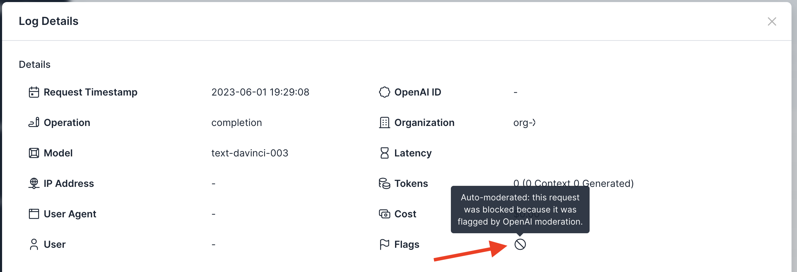

# Policy: Auto-Moderation

## Background
OpenAI has a free [moderation API](https://platform.openai.com/docs/guides/safety-best-practices/use-our-free-moderation-api) which they recommend using to evaluate all user-provided content prior to passing it to OpenAI's completion or embedding APIs. Not properly moderating content can lead to getting banned by OpenAI. While you can use the moderation API via OpenAI's SDKs, it requires updates to your codebase to inject additional pre-processing code before each API call. When using tools like LangChain, the actual API call may be abstracted, making it more difficult to determine where to perform the moderation call.

Usage Panda solves this problem by dynamically injecting a call to the moderation API via its proxy. If the moderation call returns a high likelihood of sensitive content, the request is blocked and not set to the completion or embedding API. This is done fully within the Usage Panda proxy with no changes to your codebase.

## Enabling the Setting
To perform auto-moderation of API calls:

1. Navigate to the [API Keys](https://app.usagepanda.com/connections) page
2. Click the gear (settings) icon on the API key you wish to modify
3. Scroll down to the "Auto-Moderate" setting and toggle the setting
4. Click "Save"

## Setting via Headers
You can optionally override this setting on a per-request basis by passing the `x-usagepanda-auto-moderate` header, like so:

```python
response = openai.Completion.create(
  model="text-davinci-003",
  prompt="[sensitive content here]",
  headers={ # Usage Panda Auth
    "x-usagepanda-api-key": USAGE_PANDA_KEY,
    "x-usagepanda-auto-moderate": "true"
  }
)
output = response.choices[0].text
```

The above request will fail if sensitive content is defined in the prompt and include a reason (e.g., self-harm)

```
openai.error.APIError: Usage Panda: Moderation flagged this request: self-harm {"error":{"message":"Usage Panda: Moderation flagged this request: self-harm","type":"invalid_request","param":null,"code":null}} 422 {'error': {'message': 'Usage Panda: Moderation flagged this request: self-harm', 'type': 'invalid_request', 'param': None, 'code': None}} {'Access-Control-Allow-Headers': '*', 'Access-Control-Allow-Origin': '*', 'Access-Control-Allow-Methods': 'OPTIONS,POST,GET', 'Content-Type': 'application/json', 'Date': 'Thu, 01 Jun 2023 23:29:08 GMT', 'Connection': 'keep-alive', 'Keep-Alive': 'timeout=5', 'Transfer-Encoding': 'chunked'}
```

## Flagged Requests

Requests that are blocked because of the auto-moderation setting will be flagged in the logs:

