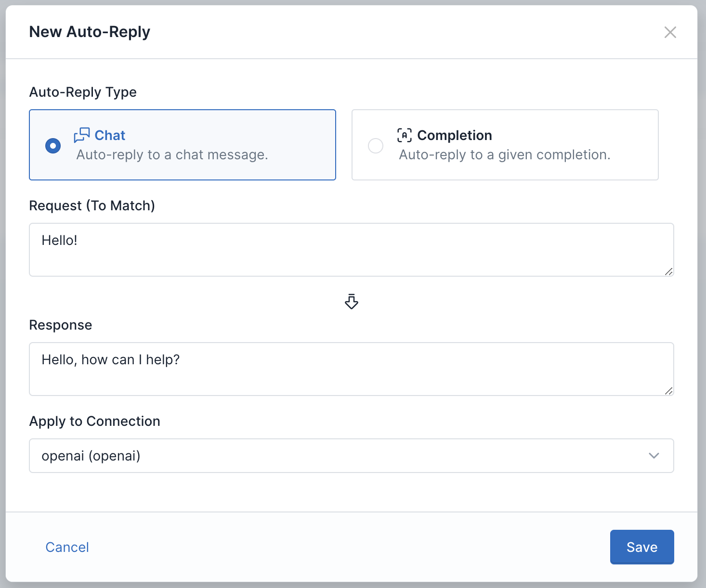
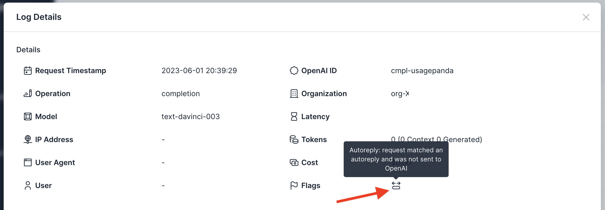

# Auto-Replies

## Background
In some cases, you may wish to always reply to a certain prompt or chat with the same response. This can be useful to override an LLM's default behavior (such as always replying with the same greeting when a user says "Hello"), hardcode known test strings for integration or end-to-end testing (such as using a unique random string to indicate a successful integration test) without incurring costs, or for caching popular queries or requests.

Usage Panda allows you to define a series of "auto-reply" phrases which, when matched, will always return the defined response. The request will be returned in the same API format, but will not be sent to OpenAI's API. This allows you to save costs while ensuring consistency for a subset of known replies.

## Enabling the Setting
To create auto-replies:

1. Navigate to the [Auto-Replies](https://app.usagepanda.com/autoreplies) page
2. Click the "+ Add Auto-Reply" button at the top right
3. Define request and response strings
4. Click "Save"

## Flagged Requests

Requests that match known auto-replies are flagged like so:

