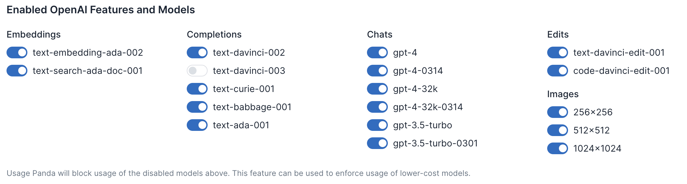
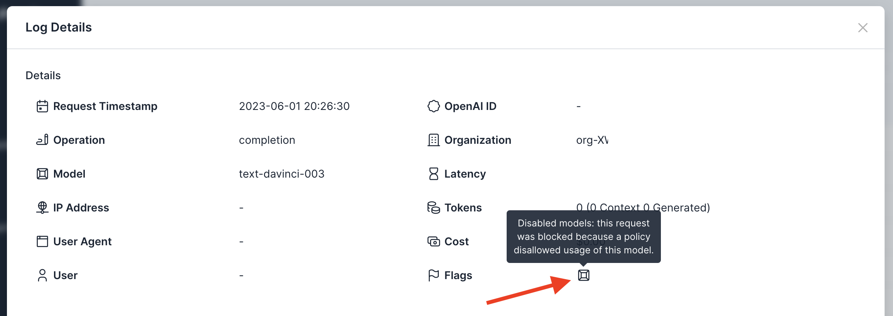

# Policy: Blocked Models

## Background
OpenAI's API supports completions, chat completions, embeddings, image generations, and more. However, most applications only take advantage of a small subset of these features. To avoid accidental or malicious use of features or models, Usage Panda can optionally block those API calls. For example, your chat application may only use gpt-3.5-turbo, in which case you should block embeddings, edits, and image generation models from being used.

## Enabling the Setting
To block models:

1. Navigate to the [API Keys](https://app.usagepanda.com/connections) page
2. Click the gear (settings) icon on the API key you wish to modify
3. Scroll down to the "Enabled OpenAI Features and Models" setting and toggle each of the models you wish to disable
4. Click "Save"



Requests that are blocked will result in the following error:

```
openai.error.APIError: Usage Panda: Config set to block usage of model: text-davinci-003 {"error":{"message":"Usage Panda: Config set to block usage of model: text-davinci-003","type":"invalid_request","param":null,"code":null}} 422 {'error': {'message': 'Usage Panda: Config set to block usage of model: text-davinci-003', 'type': 'invalid_request', 'param': None, 'code': None}} {'Access-Control-Allow-Headers': '*', 'Access-Control-Allow-Origin': '*', 'Access-Control-Allow-Methods': 'OPTIONS,POST,GET', 'Content-Type': 'application/json', 'Date': 'Fri, 02 Jun 2023 00:26:30 GMT', 'Connection': 'keep-alive', 'Keep-Alive': 'timeout=5', 'Transfer-Encoding': 'chunked'}
```

## Setting via Headers
_This feature is currently not configurable via headers._

## Flagged Requests

Requests that are blocked because of the blocked models setting will be flagged in the logs:

