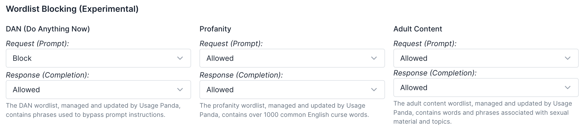
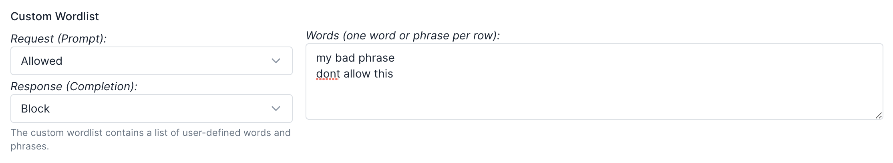
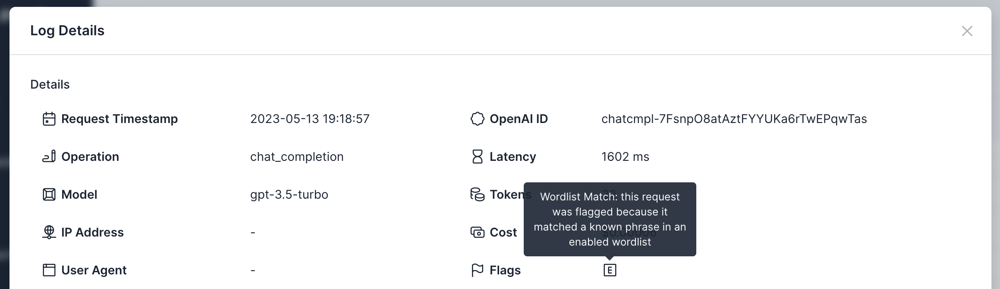

# Content Blocking
{:toc}

Both LLMs, as well as users, can be wildly unpredictable. While popular LLM APIs, like OpenAI, have moderation endpoints, those are quite limited to a small set of categories of sensitive content. With Usage Panda, you can gain greater flexibility over the type of content that you enable to be sent to, and received from, LLMs as part of your application.

Usage Panda supports several types of content blocking and moderation:

1. Auto-Moderation - injecting an API call to OpenAI's moderation endpoint prior to processing a completion or embedding request.
2. Wordlist Blocking - audit, redact, or block completion or embedding requests, or OpenAI responses, that contain profanity, adult content, or requests that may indicate malicious user behavior (e.g., attempting to reveal the system prompt).
3. Custom Wordlist Blocking - audit, redact, or block completion or embedding requests, or OpenAI responses, that contain any custom words or phrases.

## Auto-Moderation
When you enable the auto-moderation feature, Usage Panda extracts the user-provided content from every completion or embedding request and first calls OpenAI's [moderation API](https://platform.openai.com/docs/api-reference/moderations/create).

If the response from OpenAI indicates that the request contains flagged content, Usage Panda will block the request and return an error message stating that the content was flagged as moderated.

While this process is possible to do without Usage Panda, it requires additional steps in your codebase to first call the moderation API and then process the response. With Usage Panda Auto-Moderation enabled, your requests to the `/completions`, `/chat/completions`, and `/embeddings` endpoints are moderated automatically without any code changes.

## Wordlist Blocking
Usage Panda maintains several lists of words and phrases associated with profanity and adult content. For each list, you can choose to audit, redact, or block requests or responses containing those words:

* **Audit** - Requests that contain a matching word from the wordlist will be flagged for review (visible in the "Logs" dashboard), but will otherwise not be modified.
* **Redact** - Requests that contain a matching word from the wordlist will be updated to redact the text using "****" strings. The original text will still be available in the "Logs" dashboard for debugging.
* **Block** - Requests that contain a matching word from the wordlist will be blocked and an error will be returned to the application or service calling the OpenAI API.

{: .warning }
Before blocking a wordlist, we recommend using "audit" mode to monitor for possible impact to your end users. Once you're comfortable with the behavior, you can change to "block" mode.

### Custom Wordlists
In addition to the wordlists managed by Usage Panda, you can optionally provide up to 100 custom words and phrases that you wish to have audited, redacted, or blocked.

To set up a custom wordlist, navigate to the Usage Panda dashboard, click "Connections," select the settings icon to open the connection policy, and then scroll down to "Custom Wordlist". First, enter the words or phrases in the textbox, separated by newlines. Then, select "audit," "redact," or "block" for each of "request" and "response."

## "Do Anything Now" (DAN) Prompt Injection Controls (Experimental)
"Do Anything Now" is a "jailbreak" attempt at getting an LLM to ignore its default instructions and complete a user-defined task, usually by using complex phrases to "trick" an LLM into behaving in a different way. DAN was first popularized on Reddit, [HackerNews](https://news.ycombinator.com/item?id=34676043), and other forums as a way to bypass limitations on popular LLM-based tools.

Usage Panda has created a managed wordlist containing many of the top phrases used in DAN attempts. By enabling the DAN filter, you can audit for, redact, or block these requests if the keywords appear in either the user-provided request, or the response from OpenAI.

{: .warning }
There are currently no foolproof preventative controls to avoiding prompt injection or prompt reflection attacks. Usage Panda's DAN filter is a best effort attempt at detecting _potentially_ malicious requests and should be considered in combination with other user security signals (e.g., rate of requests, prompt text, age of account, etc.).

## Viewing Flagged and Moderated Content
If you choose to "audit" content on the managed or custom wordlists, Usage Panda will mark the matched requests with a "content" flag. You can then view these requests on the "Logs" page:

