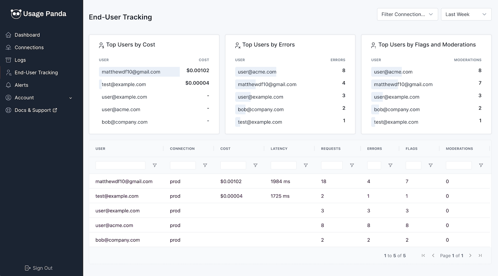

# End-User Tracking

End-user tracking allows you to associate API requests with your application's end users. This allows you to determine which of your users are experiencing errors as a result of LLM calls, which users are driving your OpenAI API costs, and which users may be sending sensitive content that is being flagged by OpenAI's moderation API, or Usage Panda's security controls.

## Pre-Requisites
Usage Panda leverages OpenAI's [end-user id](https://platform.openai.com/docs/guides/safety-best-practices/end-user-ids) field. Simply pass the `user` parameter to any supported API call, and Usage Panda will auto-discover and record it along side the other request metadata.

For example, the below request includes the `user123456` value for the `user` field:
```
response = openai.Completion.create(
  model="text-davinci-003",
  prompt="This is a test",
  max_tokens=5,
  user="user123456"
)
```

## Enforce User IDs
To ensure that a user ID is sent and captured as part of every request, Usage Panda has an opt-in setting called "Enforce User IDs" that will block requests in which the `user` field is not present. This is a useful safeguard to ensure proper tracking, but does come at the expense of blocking otherwise-valid OpenAI API requests, so be sure to consider these tradeoffs carefully before opting in.

To enable user ID enforcement:

1. Navigate to the "Connections" page
2. Click the "Settings" icon on the connection you wish to modify
3. Toggle the "Enforce User IDs" toggle

## End-User Tracking Dashboard
After you begin sending requests with the "user" field to Usage Panda via your connection, they will appear immediately in the "End-User Tracking" dashboard. From here you can see the top users across dimensions of cost, errors, and moderations/flags.

