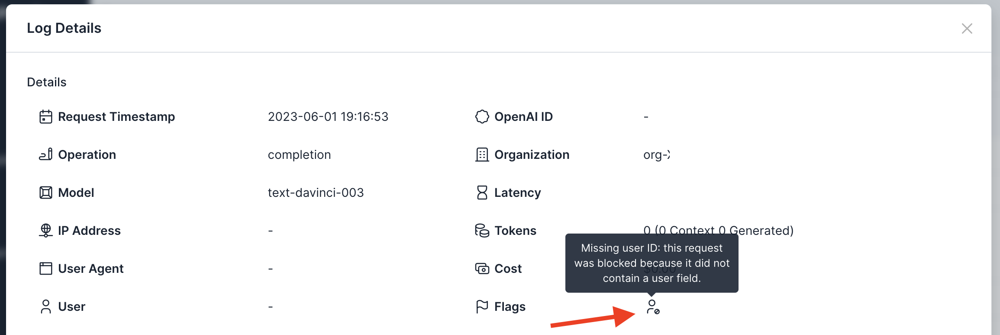

# Policy: Enforce User IDs

## Background
OpenAI [supports a "user" parameter](https://platform.openai.com/docs/guides/safety-best-practices/end-user-ids) used to uniquely identify end users of your application. This parameter is useful for associating your application's users with specific requests and costs. However, this feature is only available if the "user" parameter is set on all requests. Usage Panda supports enforcement of this parameter, ensuring that un-attributed requests cannot be sent to OpenAI.

## Enabling the Setting
To enforce the use of user IDs:

1. Navigate to the [API Keys](https://app.usagepanda.com/connections) page
2. Click the gear (settings) icon on the API key you wish to modify
3. Scroll down to the "Enforce User IDs" setting and toggle the setting
4. Click "Save"

## Setting via Headers
You can optionally override this setting on a per-request basis by passing the `x-usagepanda-enforce-user-ids` header, like so:

```python
response = openai.Completion.create(
  model="text-davinci-003",
  prompt="Hello there",
  headers={ # Usage Panda Auth
    "x-usagepanda-api-key": USAGE_PANDA_KEY,
    "x-usagepanda-enforce-user-ids": "true"
  }
)
output = response.choices[0].text
```

The above request will fail because the `user` parameter is not set.

```
openai.error.APIError: Usage Panda: Config set to block requests without user field {"error":{"message":"Usage Panda: Config set to block requests without user field","type":"invalid_request","param":null,"code":null}} 422 {'error': {'message': 'Usage Panda: Config set to block requests without user field', 'type': 'invalid_request', 'param': None, 'code': None}} {'Access-Control-Allow-Headers': '*', 'Access-Control-Allow-Origin': '*', 'Access-Control-Allow-Methods': 'OPTIONS,POST,GET', 'Content-Type': 'application/json', 'Date': 'Thu, 01 Jun 2023 23:16:53 GMT', 'Connection': 'keep-alive', 'Keep-Alive': 'timeout=5', 'Transfer-Encoding': 'chunked'}
```

## Flagged Requests

Requests that are blocked because of the enforce user IDs setting will be flagged in the logs:

