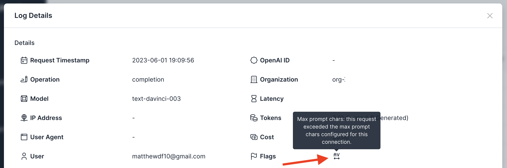

# Policy: Enforce Max Prompt Characters

## Background
The primary drivers of cost associated with LLM API requests is the size of the context (prompt) and the size of the generated response. The simplest way to avoid expensive API requests is to reduce or limit the size of the prompt. To help avoid accidental cost overruns, Usage Panda supports a hard limit on the maximum prompt size by characters. Setting this limit helps avoid accidentally submitting excessively large prompts. Usage Panda defines the prompt size by the number of characters (not tokens) because it is easier to reason about and calculate. There are roughly 4 characters per token, although we recommend using [OpenAI's tokenizer](https://platform.openai.com/tokenizer) for an exact count.

## Enabling the Setting
To enforce the max prompt characters:

1. Navigate to the [API Keys](https://app.usagepanda.com/connections) page
2. Click the gear (settings) icon on the API key you wish to modify
3. Scroll down to the "Enforce Max Prompt Characters" setting and enter a value
4. Click "Save"

## Setting via Headers
You can optionally override this setting on a per-request basis by passing the `x-usagepanda-max-prompt-chars` header, like so:

```python
response = openai.Completion.create(
  model="text-davinci-003",
  prompt="Hello there",
  headers={ # Usage Panda Auth
    "x-usagepanda-api-key": USAGE_PANDA_KEY,
    "x-usagepanda-max-prompt-chars": "5"
  }
)
output = response.choices[0].text
```

The above request will fail because the `prompt` is 11 characters long.

```
openai.error.APIError: Usage Panda: Config set to max prompt chars of: 5; prompt was: 11 {"error":{"message":"Usage Panda: Config set to max prompt chars of: 5; prompt was: 11","type":"invalid_request","param":null,"code":null}} 422 {'error': {'message': 'Usage Panda: Config set to max prompt chars of: 5; prompt was: 11', 'type': 'invalid_request', 'param': None, 'code': None}} {'Access-Control-Allow-Headers': '*', 'Access-Control-Allow-Origin': '*', 'Access-Control-Allow-Methods': 'OPTIONS,POST,GET', 'Content-Type': 'application/json', 'Date': 'Thu, 01 Jun 2023 23:09:56 GMT', 'Connection': 'keep-alive', 'Keep-Alive': 'timeout=5', 'Transfer-Encoding': 'chunked'}
```

## Flagged Requests

Requests that are blocked because of the max prompt characters setting will be flagged in the logs:

