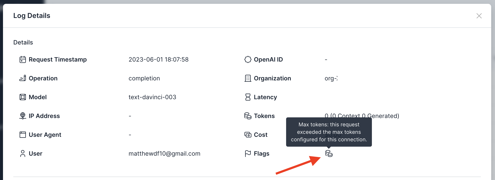

# Policy: Enforce Max Tokens

## Background
The OpenAI API [supports](https://platform.openai.com/docs/api-reference/completions/create#completions/create-max_tokens) a parameter called `max_tokens` for completion and chat completion requests. This parameter determines how many tokens are used to generate the response. If this parameter is not set, the length of the response can vary, and the associated costs can vary as well. To more carefully control these costs, it is recommended to set this parameter according to your use case and cost sensitivity for your application.

Usage Panda can help enforce that this parameter is always set in your requests by blocking requests that either do not define the `max_tokens` parameter, or set it to a value higher than a pre-defined threshold. This is a relatively simple, but effective, cost control mechanism.

## Enabling the Setting
To enforce the max tokens parameter:

1. Navigate to the [API Keys](https://app.usagepanda.com/connections) page
2. Click the gear (settings) icon on the API key you wish to modify
3. Scroll down to the "Enforce Max Tokens" setting and enter a value
4. Click "Save"

## Setting via Headers
You can optionally override this setting on a per-request basis by passing the `x-usagepanda-max-tokens` header, like so:

```python
response = openai.Completion.create(
  model="text-davinci-003",
  prompt="Hello there",
  headers={ # Usage Panda Auth
    "x-usagepanda-api-key": USAGE_PANDA_KEY,
    "x-usagepanda-max-tokens": "100"
  }
)
output = response.choices[0].text
```

The above request will fail because the `max_tokens` parameter is not set:

```
openai.error.APIError: Usage Panda: Config set to max tokens of: 10; request was: 50 {"error":{"message":"Usage Panda: Config set to max tokens of: 10; request was: 50","type":"invalid_request","param":null,"code":null}} 422 {'error': {'message': 'Usage Panda: Config set to max tokens of: 10; request was: 50', 'type': 'invalid_request', 'param': None, 'code': None}} {'Access-Control-Allow-Headers': '*', 'Access-Control-Allow-Origin': '*', 'Access-Control-Allow-Methods': 'OPTIONS,POST,GET', 'Content-Type': 'application/json', 'Date': 'Thu, 01 Jun 2023 23:11:11 GMT', 'Connection': 'keep-alive', 'Keep-Alive': 'timeout=5', 'Transfer-Encoding': 'chunked'}
```

## Flagged Requests

Requests that are blocked because of the max tokens setting will be flagged in the logs:

