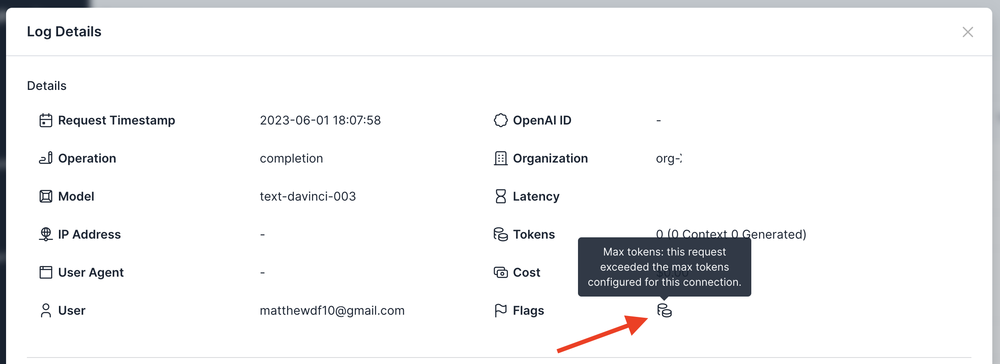

# Prompt Reflection Detection

## Background
Prompt reflection is an LLM attack vector in which an end user "tricks" an LLM into responding with the full contents of its original prompt. While this is often harmless, it can cause affect the reputation of an application or possibly reveal proprietary "prompt engineering" techniques that developers would prefer not to expose to end users.

The simplest way to prevent prompt reflection attacks is to check the response text to determine whether the original prompt text appears within it. Usage Panda has an experimental control that can help audit, redact, or block these types of attacks.

{: .warning }
Prompt reflection prevention is not foolproof. Attackers can use an unlimited number of means to reveal the original prompt and evade detection techniques. Do not rely on this control to fully protect sensitive content. Instead, it should one tool used to evaluate end user behavior for possible malicious activity.

## Enabling the Setting
To enable the prompt reflection detection:

1. Navigate to the [API Keys](https://app.usagepanda.com/connections) page
2. Click the gear (settings) icon on the API key you wish to modify
3. Scroll down to the "Prompt Reflection" setting and select "none," "audit," "redact," or "block."
4. Click "Save"

The options for this setting are:

* `none` - Prompt reflection detection is not enabled
* `audit` - Requests that result in prompt reflection will be flagged, but not blocked
* `redact` - Requests that result in prompt reflection will be redacted (with the string `****`), but not blocked
* `block` - Requests that result in prompt reflection will be blocked

Additionally, you must indicate which portion of your prompt is system generated by surrounding it with `||` markers. For example:

```
prompt="||You are a crime solving bot. For the following text, analyze for clues and return next steps for gathering evidence.|| User-generated content goes here."
```

## Setting via Headers
You can optionally override this setting on a per-request basis by passing the `x-usagepanda-prompt-reflection` header, like so:

```python
response = openai.Completion.create(
  model="text-davinci-003",
  prompt="Hello there",
  headers={ # Usage Panda Auth
    "x-usagepanda-api-key": USAGE_PANDA_KEY,
    "x-usagepanda-prompt-reflection": "block"
  }
)
output = response.choices[0].text
```

## Flagged Requests

Requests that are blocked because of the max tokens setting will be flagged in the logs:

