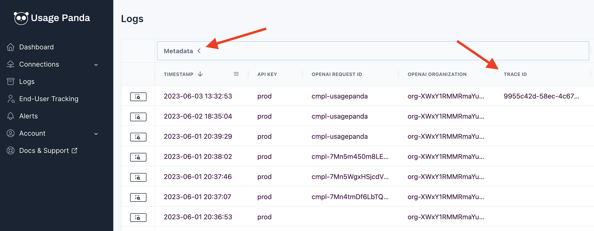

# Request Tracing

## Background
Request tracing allows you to provide a unique ID used to trace requests to the OpenAI API. This is useful for debugging, or to link subsequent API requests that are part of the same application flow. For example, you may create an embedding and then a completion as part of the same user request, which represents two API calls. A trace ID allows you to link these two requests together so that they can be visually linked in the Usage Panda logs.

## Setting via Headers
The trace ID is sent via the header: `x-usagepanda-trace-id`. For example:

```python
response = openai.Completion.create(
  model="text-davinci-003",
  prompt="Hello there",
  headers={ # Usage Panda Auth
    "x-usagepanda-api-key": USAGE_PANDA_KEY,
    "x-usagepanda-trace-id": "my-custom-trace-id"
  }
)
output = response.choices[0].text
```

{: .warning }
Trace IDs must be strings under 100 characters and consist only of alphanumeric characters, dashes, or underscores (-, _).

## Viewing Trace IDs

From the Usage Panda [Logs](https://app.usagepanda.com/records) page, click the "Metadata" column header to expand additional metadata about the requests. You can then click the "Trace ID" column to sort or filter by trace ID.

