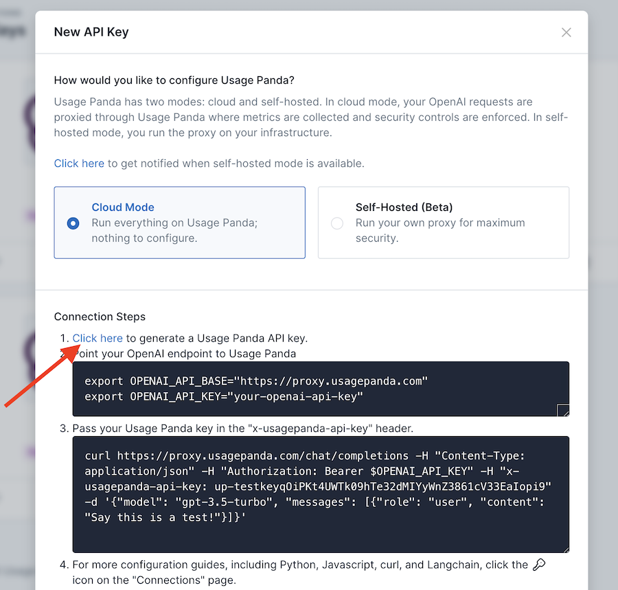
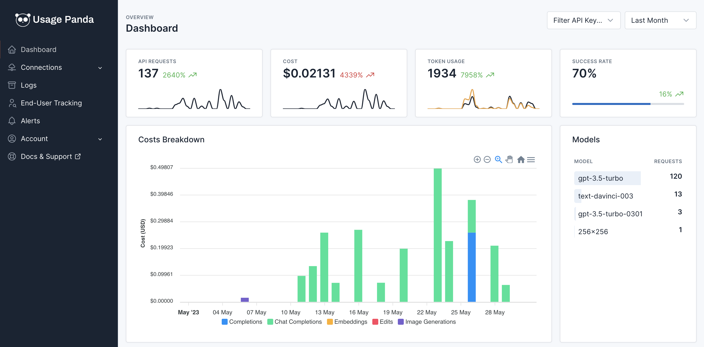

# Getting Started

## Requirements
You must have an OpenAI account and API key before configuring Usage Panda.

{: .warning }
Usage Panda is currently in beta and features may change without notice (although we'll do our best to avoid it!). Please use caution before deploying Usage Panda to production.

## Sign Up for Usage Panda
Usage Panda is accessed as a SaaS application from your web browser.

[Sign Up](https://app.usagepanda.com/signin){: .btn .btn-purple }

{: .note }
Usage Panda does not use passwords. Please sign up using an email address you have access to. When signing in, Usage Panda will send you a temporary sign in link to click.

## Configuring Usage Panda

To use Usage Panda, you must first configure an **API Key** from the [API Keys](https://app.usagepanda.com/connections?new=true) page. An API key allows you to connect to Usage Panda via an OpenAI-compatible endpoint through which you can define and enforce custom policies.



You must then make two small changes to your application environment:
1. Set `openai.api_base` to `"https://proxy.usagepanda.com"`
2. Pass the `x-usagepanda-api-key` header in your requests

```python
openai.api_base = "https://proxy.usagepanda.com"
openai.api_key = "sk-..."

response = openai.ChatCompletion.create(
    model="gpt-3.5-turbo",
    messages=[
            {"role": "system", "content": "You are a helpful assistant"},
            {"role": "user", "content": "Hello there"}
    ],
    headers={ # Usage Panda Auth
        "x-usagepanda-api-key": "up-..."
    }
)
```

No other code changes are required. The next time your application makes a call to the OpenAI API, it will be routed through the Usage Panda proxy where your custom policy will be enforced and metrics will be collected. You can view your requests on the [Logs](https://app.usagepanda.com/records) page in real-time.

By default, Usage Panda does not apply any additional policy controls (it simply passes the request and response through and records usage metrics, such as cost and latency). However, you should be able to see your requests on the "Logs" page as soon as they are sent.

You will also see your dashboard populated with usage metrics, cost data, etc.



## Next Steps
Once Usage Panda is working, you can begin configuring policies on your connection. Check out the [Features](/features.html) page for a list of available policies and controls.