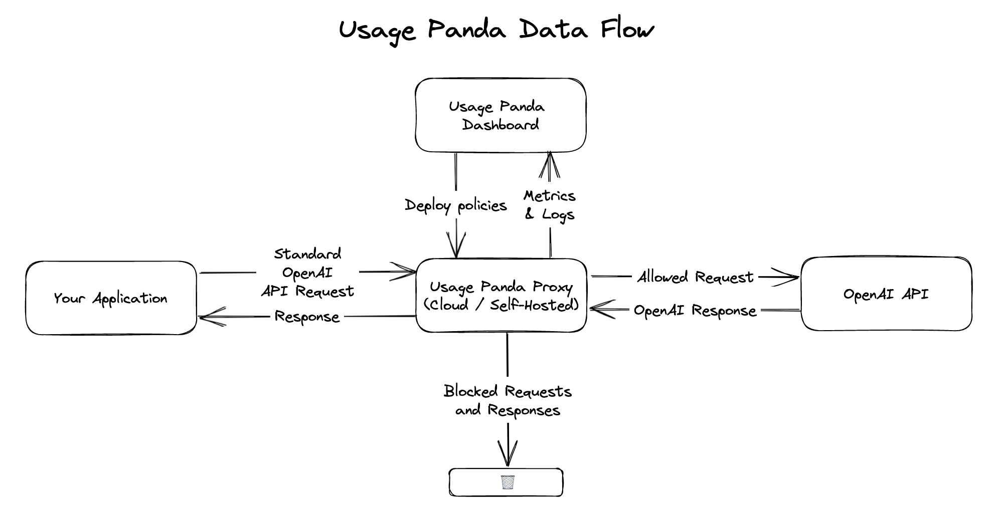

# Usage Panda Documentation

{: .warning }
Usage Panda is currently in public beta. While we expect most features to remain stable, there may be occasional changes without warning.

## What is Usage Panda?
[Usage Panda](https://usagepanda.com) is a security and observability platform for OpenAI, enabling safe and cost effective large language model (LLM) usage for developers and organizations. At its core, Usage Panda is a proxy that sits between your applications or developers and LLM APIs. From here, Usage Panda can enforce cost and security controls and other policies, _before_ the request is processed, and record logs and metrics for processing or review afterwards. There are no code changes required to use Usage Panda, other than to update two OpenAI environment variables.

## What does Usage Panda do?
Usage Panda inspects API request being sent to LLM providers such as OpenAI, ensures they comply with a policy you define, audits the request, and then either blocks it or allows it to proceed. Along the way, detailed audit logs and metrics are recorded for visibility.

## Why do I need Usage Panda?
Using LLM APIs locally for testing is relatively straightforward. However, deploying an application to production that leverages APIs like OpenAI's is considerably more challenging due to a variety of operational and security concerns. Usage Panda helps you safely productionize your usage of these APIs, allowing you to focus on your core business.

Some of the many things Usage Panda can help with include:
* **Detailed Cost Monitoring** - Did your OpenAI bill spike after a wave of new users? Usage Panda can help you track down, in real time, which requests or users led to the cost increase.
* **Cost Rate Limiting** - block requests when the prompt size exceeds a configurable length to avoid unexpected costs.
* **End User ID Tracking** - Usage Panda can enforce the usage of the "user" field in OpenAI API requests and then use that field to associate your application's end users with specific cost, security, and usage details.
* **Content Blocking** - Usage Panda can block common patterns of profanity and adult material in either the request to, or response from, OpenAI.
* **Prompt Security** - Usage Panda can audit, block, or redact hundreds of phrases commonly associated with "prompt hacking" in which a malicious user attempts to reveal or tamper with your application's system prompt.
* **Model Enforcement** - block higher-cost models, or those not required by your application, such as DALL-E, Whisper, etc. to help prevent accidental usage.
* **Auto-Moderation** - with no code changes, automatically pass all user-provided data to OpenAI's (free) moderation API prior to requesting an embedding or completion. Requests that are flagged can be blocked, preventing wasted token consumption.
* **Alerts** - (coming soon) get notified of cost increases, flagged or moderated content, or suspicious user behavior.