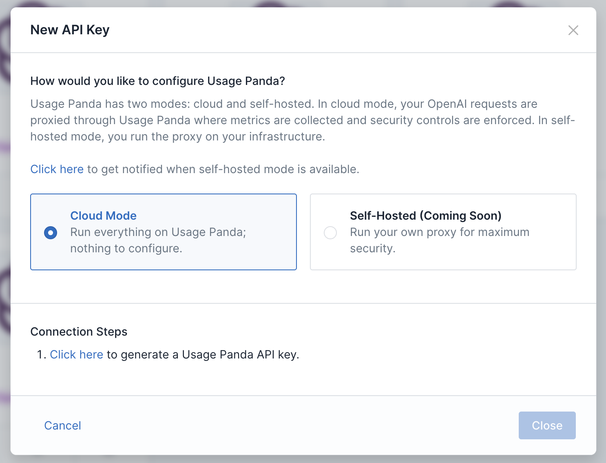

# Proxy Modes

Usage Panda functions as a proxy between your application or developers and OpenAI's API in order to apply policy enforcement, logging, monitoring, and other functionality. There are two supported proxy modes: cloud and self-hosted. Cloud mode provides simplicity, ease of use, and scalability via a fully managed service. Self-hosted mode provides maximum control over your data by routing requests through a proxy that is fully isolated within your infrastructure.

## Cloud Mode Proxy

With cloud mode, there is no infrastructure to manage. Simply generate your Usage Panda API key, point your application to the `https://proxy.usagepanda.com` endpoint and begin sending requests. Usage Panda will handle scaling, updates, and other operational aspects.



In your application code, update the OpenAI endpoint and pass the Usage Panda API key:

```python
import openai

openai.api_key = "sk-openaiapikey"
openai.api_base = "https://proxy.usagepanda.com"

response = openai.ChatCompletion.create(
  model="gpt-3.5-turbo",
  messages=[
        {"role": "system", "content": "You are a helpful assistant"},
        {"role": "user", "content": "Say hello!"}
  ],
  headers={
    "x-usagepanda-api-key": "up-usagepandaapikey"
  }
)
output = response.choices[0].message
print(output)
```

## Self-Hosted Proxy

When running a self-hosted proxy, Usage Panda will provide you with the proxy component (as a Docker image or Lambda function). The Docker image can be deployed as a typical web server and logs to stdout/stderr. Once you've deployed the proxy, you can provide your proxy's endpoint to Usage Panda. Your proxy does not need to be internet-accessible (in fact, we strongly recommend placing it behind an internal firewall or VPN.)

### Getting Access
During the beta, you must contact Usage Panda support to begin using the self-hosted proxy. We are working with a limited set of design partners, so please be sure to share details about your use case.

1. Open a support ticket with `support@usagepanda.com` requesting access to the self-hosted beta. Please include the email address of your Usage Panda account, as well as a GitHub user ID(s), which will be used to provide access to the proxy container via GitHub Container Registry (gcr). If you prefer to use a serverless AWS Lambda function, please let support know and we will provide a ZIP file instead.
2. Support will invite your user to the GitHub Container Registry, and you can pull the image:
    ```
    $ docker pull ghcr.io/usagepanda/proxy:0.0.2
    ```

### Configuration
The proxy is configured via a config file, which you can copy from the example below and save in your current working directory as `config.js`. It can then be mounted into the container to overwrite the default config using the `-v $(pwd)/config.js:/config.js:ro` CLI argument. If you do not use a local config file, the proxy will attempt to load its config from Usage Panda's API based on the Usage Panda API key sent in the request headers.

```javascript
export default {
    // Local mode determines whether the proxy is operating in isolation without requiring
    // connectivity to Usage Panda's API. If set to "true", requests received by the proxy
    // will be processed entirely using the local configuration and no stats will be sent
    // to Usage Panda's API.
    LOCAL_MODE: false,
    
    // The Usage Panda API from which to load the config and send stats after each request.
    // This is not used in local mode.
    USAGE_PANDA_API: process.env['USAGE_PANDA_API'] || 'https://api.usagepanda.com/v1',
    
    // The API key obtained from Usage Panda. Used to authenticate API requests.
    // If this is not set here, it must be passed in via the x-usagepanda-api-key header.
    USAGE_PANDA_API_KEY: process.env['USAGE_PANDA_API_KEY'],

    // Your upstream OpenAI API key. Used to authenticate requests to OpenAI's API.
    // If this is not set here, it must be passed in via the authorization header.
    OPENAI_API_KEY: process.env['OPENAI_API_KEY'],
    
    // The default upstream LLM base path.
    LLM_API_BASE_PATH: 'https://api.openai.com/v1',

    // How many minutes the proxy will cache the config. This is only used when
    // local mode is set to "false".
    CONFIG_CACHE_MINUTES: 5,

    // The CORS headers to return for requests. If not accessing the API via a web browser,
    // you can remove the access-control properties (keep the content-type).
    CORS_HEADERS: {
        'Access-Control-Allow-Headers' : '*',
        'Access-Control-Allow-Origin': '*',
        'Access-Control-Allow-Methods': 'OPTIONS,POST,GET',
        'Content-Type': 'application/json'
    },

    // When a request or response is set to "redact", this string will be used to redact the
    // matching text.
    REDACTION_STRING: '****',

    // This string will be used to mark the start and end of a given prompt when checking
    // for prompt reflection attacks (prompt appears in the response).
    PROMPT_REFLECTION_DELIMETER: '||',

    // Policy settings: the below config options control the custom policy options for this proxy
    
    // Models listed here will be disabled and an error will be returned if they are used.
    // Options include:
    // "text-embedding-ada-002", "text-search-ada-doc-001",
    // "text-davinci-002", "text-davinci-003", "text-curie-001", "text-babbage-001", "text-ada-001",
    // "gpt-4", "gpt-4-0314", "gpt-4-32k", "gpt-4-32k-0314", "gpt-3.5-turbo", "gpt-3.5-turbo-0301",
    // "text-davinci-edit-001", "code-davinci-edit-001", "256x256", "512x512", "1024x1024"
    POLICY_DISABLED_MODELS: [],
    
    // Auto-reply settings. Responses for matching requests will be returned instantly without being
    // sent to the upstream LLM API. Format:
    // {"type": "chat", "request": "hello", "response": "Hello, how can I help?"}
    // "type": "chat" | "completion"
    POLICY_AUTOREPLY: [],

    // Pre-defined wordlists to block, audit, or redact
    // Format: profanity:block,dan:redact,custom:audit
    POLICY_REQUEST_WORDLIST: '',

    // Pre-defined wordlists to block, audit, or redact
    // Format: profanity:block,dan:redact,custom:audit
    POLICY_RESPONSE_WORDLIST: '',
    
    // Array of custom words or phrases that should be audited, redacted, or blocked when the "custom"
    // wordlist setting is passed. Example: ["bad word", "special phrase"]
    POLICY_CUSTOM_WORDLIST: [],
    
    // If set, requests with max_tokens exceeding this value will be blocked. 0 = disabled.
    POLICY_MAX_TOKENS: 0,

    // If set, requests with prompt size (in characters) exceeding this value will be blocked. 0 = disabled.
    POLICY_MAX_PROMPT_CHARS: 0,

    // If set to "true", user-generated content from every request will be sent to OpenAI's moderation endpoint
    // for review prior to invoking the original API call.
    POLICY_AUTO_MODERATE: false,

    // If set to "true", supported requests without the "user" field set will be blocked.
    POLICY_ENFORCE_USER_IDS: false,
    
    // If set to "true", the full contents of the request will be logged locally.
    POLICY_LOG_REQUEST: false,

    // If set to "true", the full contents of the response will be logged locally.
    POLICY_LOG_RESPONSE: false,

    // Prompt reflection detection. Determines whether the contents of a given prompt appear in the response.
    // Options: none, audit, redact, block.
    POLICY_PROMPT_REFLECTION: 'none',

    // Azure configuration options to use the Azure endpoints with no changes to end codebase
    AZURE_RESOURCE_NAME: null,
    AZURE_DEPLOYMENT_ID: null,
};
```

### Deploying the Proxy
You can deploy the image locally or on a platform of your choosing. We recommend these guides for: [AWS ECS](https://aws.amazon.com/getting-started/hands-on/deploy-docker-containers/), [Google Cloud Run](https://cloud.google.com/run/docs/deploying), and [Azure Container Instance](https://learn.microsoft.com/en-us/azure/container-instances/container-instances-quickstart).

You can run your container using the following command (we are using port 9000 here, but you can change this to your preference):
```
$ docker run --restart=always -p 9000:9000 -d -v $(pwd)/config.js:/config.js:ro ghcr.io/usagepanda/proxy:0.0.2
```

{: .warning }
The Usage Panda proxy does not provide native TLS termination. We recommend fronting your Docker application with a load balancer or cloud-managed service. We also recommend using security groups or other controls to limit access to your endpoint to only known IP addresses.

### Local Testing
If you are running the proxy locally, you can test it quickly using curl (be sure to set the `x-usagepanda-api-key` and `OPENAI_API_KEY` headers):

```
curl http://localhost:9000/chat/completions \
    -H "Content-Type: application/json" \
    -H "Authorization: Bearer $OPENAI_API_KEY" \
    -H "x-usagepanda-api-key: up-your-key-here" \
    -d '{
        "model": "gpt-3.5-turbo",
        "messages": [{"role": "user", "content": "Say this is a test!"}],
        "temperature": 0.7
    }'
```

### Environment Variables

* `OPENAI_API_KEY` - If set, the proxy will inject this key into requests before they are sent to OpenAI. If not set, the incoming request to the proxy must contain a valid OpenAI API key in the `authorization` header.
* `USAGE_PANDA_API_KEY` - If set, the proxy will use this key to load configs and send usage data to Usage Panda. If not set, the incoming request to the proxy must contain a valid Usage Panda API key in the `x-usagepanda-api-key` header.

### Update Usage Panda

Once you've deployed the proxy and have a functioning endpoint, please update Usage Panda support. We will verify the endpoint format and update your Usage Panda connection (API key) to route to your service instead of Usage Panda's cloud proxy. You can verify that self-hosted mode is enabled by checking the "API Keys" page.


### Fully Isolated Standalone Mode

The Usage Panda proxy can operate without any connectivity to the Usage Panda API. In this mode, the configuration is defined locally via a `config.js` file (as opposed to being loaded from Usage Panda's API) and stats and metrics about the requests are logged to stdout, but _not_ uploaded to Usage Panda.

{: .warning }
When operating in standalone mode, the Usage Panda proxy will not upload request data to Usage Panda, which means that the dashboard, logs, and other features of the SaaS product will not be available.

To run the proxy in standalone mode:

1. Create a `config.js` file in your current working directory.
2. Populate the contents using the [configuration example above](#configuration).
3. Set the `LOCAL_MODE` option to `true`.
4. Run the Docker container, passing your `OPENAI_API_KEY` and `USAGE_PANDA_API_KEY` as environment variables.
    ```
    $ docker run --restart=always -p 9000:9000 -d -e OPENAI_API_KEY="sk..." -e USAGE_PANDA_API_KEY="up..." -v $(pwd)/config.js:/config.js:ro ghcr.io/usagepanda/proxy:0.0.2
    ```
5. Note: you do not have to pass the `OPENAI_API_KEY` environment variable. If you omit it, the proxy will use the `authorization` header sent by your clients.
6. You can then test your proxy using the below API call:

```
curl http://localhost:9000/chat/completions \
    -H "Content-Type: application/json" \
    -d '{
        "model": "gpt-3.5-turbo",
        "messages": [{"role": "user", "content": "Say this is a test!"}],
        "temperature": 0.7
    }'
```

## Azure OpenAI API Support
The proxy supports Azure's OpenAI API, but you do **not** need to change your `openai.api_type` settings as OpenAI's SDK requires. Instead, simply pass the following headers and Usage Panda will handle the API conversion for you.

```python
import openai
openai.api_key = "sk-your-azure-openai-api-key"

response = openai.Completion.create(
  model="text-davinci-003",
  prompt="Hello there",
  max_tokens=50,
  temperature=0,
  headers={
    "x-usagepanda-azure-resource": "test",    # Set to your Azure resource ID
    "x-usagepanda-azure-deployment": "deploy" # Set to your Azure deployment ID
  }
)
output = response.choices[0].text
print(output)
```

### Other Considerations
* The proxy logs to stdout/stderr. You can view these logs via `docker logs` or your platform's logging tool (e.g., AWS CloudWatch)
* Using the proxy, it is possible to give your developers access to a managed, audited OpenAI endpoint without provisioning and sharing OpenAI API keys with them. Simply set the `OPENAI_API_KEY` environment variable. Requests sent to the proxy endpoint do not need to contain the OpenAI API key, as it will by dynamically injected. (Note: if you use this mode, it is critical that you protect your proxy endpoint using an alternative authentication or access control solution.)