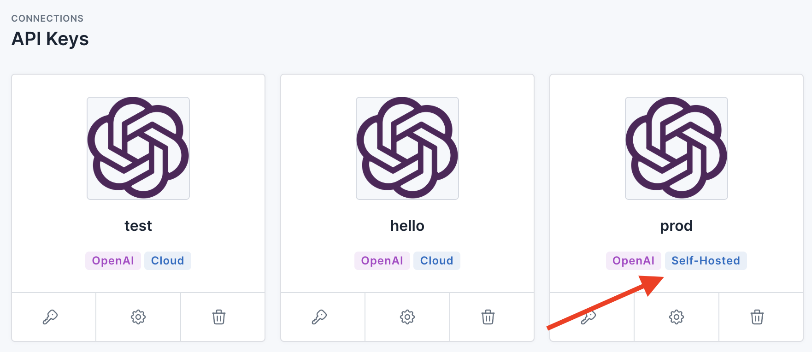

# Proxy Modes

Usage Panda functions as a proxy between your application or developers and OpenAI's API in order to apply policy enforcement, logging, monitoring, and other functionality. There are two supported proxy modes: cloud and self-hosted. Cloud mode provides simplicity, ease of use, and scalability via a fully managed service. Self-hosted mode provides maximum control over your data by routing requests through a proxy that is fully isolated within your infrastructure.

## Cloud Mode Proxy

With cloud mode, there is no infrastructure to manage. Simply generate your Usage Panda API key, point your application to the `https://proxy.usagepanda.com` endpoint and begin sending requests. Usage Panda will handle scaling, updates, and other operational aspects.


In your application code, update the OpenAI endpoint and pass the Usage Panda API key:

```python
import openai

openai.api_key = "sk-openaiapikey"
openai.api_base = "https://proxy.usagepanda.com"

response = openai.ChatCompletion.create(
  model="gpt-3.5-turbo",
  messages=[
        {"role": "system", "content": "You are a helpful assistant"},
        {"role": "user", "content": "Say hello!"}
  ],
  headers={
    "x-usagepanda-api-key": "up-usagepandaapikey"
  }
)
output = response.choices[0].message
print(output)
```

## Self-Hosted Proxy

When running a self-hosted proxy, Usage Panda will provide you with the proxy component (as a Docker image or Lambda function). The Docker image can be deployed as a typical web server and logs to stdout/stderr. Once you've deployed the proxy, you can provide your proxy's endpoint to Usage Panda. Your proxy does not need to be internet-accessible (in fact, we strongly recommend placing it behind an internal firewall or VPN.)

### Getting Access
During the beta, you must contact Usage Panda support to begin using the self-hosted proxy. We are working with a limited set of design partners, so please be sure to share details about your use case.

1. Open a support ticket with `support@usagepanda.com` requesting access to the self-hosted beta. Please include the email address of your Usage Panda account, as well as a GitHub user ID(s), which will be used to provide access to the proxy container via GitHub Container Registry (gcr). If you prefer to use a serverless AWS Lambda function, please let support know and we will provide a ZIP file instead.
2. Support will invite your user to the GitHub Container Registry, and you can pull the image:
    ```
    $ docker pull ghcr.io/usagepanda/proxy:0.0.1
    ```

### Deploying the Proxy
You can deploy the image locally or on a platform of your choosing. We recommend these guides for: [AWS ECS](https://aws.amazon.com/getting-started/hands-on/deploy-docker-containers/), [Google Cloud Run](https://cloud.google.com/run/docs/deploying), and [Azure Container Instance](https://learn.microsoft.com/en-us/azure/container-instances/container-instances-quickstart).

You can run your container using the following command (we are using port 9000 here, but you can change this to your preference):
```
$ docker run --restart=always -p 9000:9000 -d ghcr.io/usagepanda/proxy:0.0.1
```

{: .warning }
The Usage Panda proxy does not provide native TLS termination. We recommend fronting your Docker application with a load balancer or cloud-managed service. We also recommend using security groups or other controls to limit access to your endpoint to only known IP addresses.

### Local Testing
If you are running the proxy locally, you can test it quickly using curl (be sure to set the `x-usagepanda-api-key` and `OPENAI_API_KEY` headers):

```
curl http://localhost:9000/chat/completions \
    -H "Content-Type: application/json" \
    -H "Authorization: Bearer $OPENAI_API_KEY" \
    -H "x-usagepanda-api-key: up-your-key-here" \
    -d '{
        "model": "gpt-3.5-turbo",
        "messages": [{"role": "user", "content": "Say this is a test!"}],
        "temperature": 0.7
    }'
```

### Environment Variables

* `OPENAI_API_KEY` - If set, the proxy will inject this key into requests before they are sent to OpenAI. If not set, the incoming request to the proxy must contain a valid OpenAI API key in the `authorization` header.
* `USAGE_PANDA_API_KEY` - If set, the proxy will use this key to load configs and send usage data to Usage Panda. If not set, the incoming request to the proxy must contain a valid Usage Panda API key in the `x-usagepanda-api-key` header.
* `LOCAL_MODE` - If set, the proxy will not make any external requests to load its configuration or upload request stats, logs, or analytics to Usage Panda. This setting is useful for sensitive environments, but none of the features of the Usage Panda SaaS product will be available (it will function solely as a pass-through to OpenAI but with added request logging).

### Update Usage Panda

Once you've deployed the proxy and have a functioning endpoint, please update Usage Panda support. We will verify the endpoint format and update your Usage Panda connection (API key) to route to your service instead of Usage Panda's cloud proxy. You can verify that self-hosted mode is enabled by checking the "API Keys" page.



### Other Considerations
* The proxy logs to stdout/stderr. You can view these logs via `docker logs` or your platform's logging tool (e.g., AWS CloudWatch)
* Using the proxy, it is possible to give your developers access to a managed, audited OpenAI endpoint without provisioning and sharing OpenAI API keys with them. Simply set the `OPENAI_API_KEY` environment variable. Requests sent to the proxy endpoint do not need to contain the OpenAI API key, as it will by dynamically injected. (Note: if you use this mode, it is critical that you protect your proxy endpoint using an alternative authentication or access control solution.)