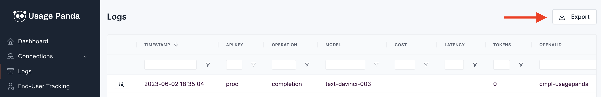

# Export OpenAI API Requests to CSV
As a proxy to OpenAI's API, Usage Panda records metrics about each request. You can view these requests on the [Logs](https://app.usagepanda.com/records) page of the Usage Panda dashboard.

From here, you can export a CSV by clicking the "Export" button at the top right of the page.

Each CSV contains the following details:

* Timestamp
* API Key
* Operation
* Model
* Cost
* Latency
* Tokens
* OpenAI ID
* Error
* Moderated
* IP Address
* User Agent
* User
* Organization