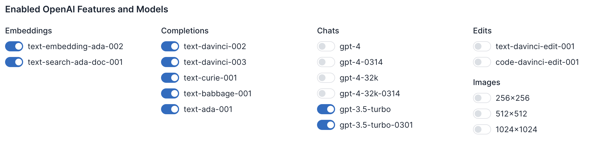
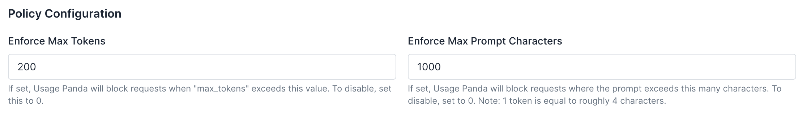
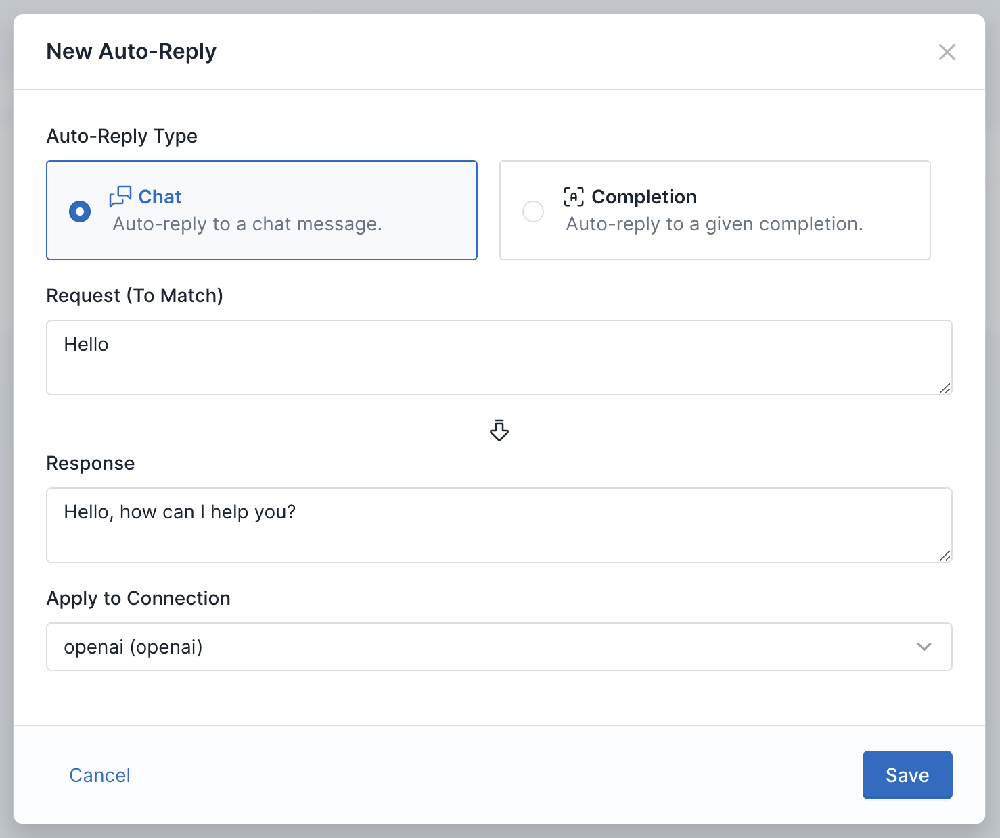
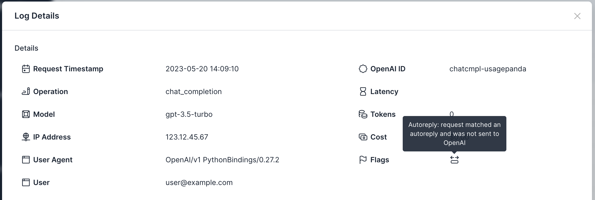

# Limit OpenAI API Requests by Cost
Natively, OpenAI supports hard and soft API cost limits. However, these are coarse-grained limits and do not give you control over individual API requests. Even with the soft limit set, it's possible for a series of accidental (or malicious) API requests to OpenAI to quickly consume all of your available credit up to this limit.

Usage Panda extends OpenAI's cost control capabilities with several additional features to help you manage your OpenAI API costs. These include:

* **Model Limits**: control which of OpenAI's models are enabled and available to your applications, preventing usage of models with higher token costs.
* **Max Tokens**: Limit the `max_tokens` parameter to control the size of OpenAI's completion responses.
* **Max Prompt Characters**: Limit the maximum number of characters of each prompt.
* **Auto-Replies**: Cache responses to known prompts and requests to limit API requests to OpenAI.

Each of these features provides a slightly different level of control over how your application consumes OpenAI tokens, so keep reading for more detail.

## Model Limits
OpenAI charges drastically different prices for its various APIs. For example, a chat completion request using the ADA model costs $0.0000004, whereas a single DALL-E image generation request at 1024x1024 resolution costs $0.02. Some tools, such as LangChain, abstract away the underlying calls to OpenAI, which may make it more likely that you use a model unintentionally.

If you don't plan to use a model, you should disable it to avoid accidental (and expensive) requests. Usage Panda allows you to opt in or out of each of OpenAI's supported models across completion, embedding, chat, and image services.

To do this, navigate to your [Usage Panda dashboard](https://app.usagepanda.com/signin), then click "Connections." Click on the settings icon for the connection you wish to modify and then scroll down to "Enabled OpenAI Features and Models." Toggle on or off each of the models to enable or disable them, and then click "Save."

## Max Tokens
OpenAI completion requests support a parameter called `max_tokens`. This tells OpenAI how many tokens to generate in its completion. Longer responses may be more complete, but cost more.

Usage Panda supports the ability to define the maximum "max_tokens" size. For example, setting this configuration to "100" would allow OpenAI API requests with `max_tokens` set to `100` or less, but block requests that exceed 100.

This is useful because it allows you to define a maximum value for this API parameter and reject requests that exceed it _before_ they are passed to OpenAI and incur token costs.

To enable this feature, navigate to your [Usage Panda dashboard](https://app.usagepanda.com/signin), then click "Connections." Click on the settings icon for the connection you wish to modify and then scroll down to "Policy Configuration." Set the "Enforce Max Tokens" value and then click "Save."

## Max Prompt Characters

{: .warning }
Usage Panda uses character count, not tokens, for this setting. Tokens are roughly equal to 4 characters. You can read more [here](https://help.openai.com/en/articles/4936856-what-are-tokens-and-how-to-count-them).

The size of your prompt has a direct impact on the cost of a given completion or embedding request. While some OpenAI models support up to 4096 tokens of context, this would result in a relatively expensive ~$0.50 API call. Limiting the maximum number of characters in a prompt helps avoid accidental or malicious requests that consume an inordinate number of tokens.

To enable this feature, navigate to your [Usage Panda dashboard](https://app.usagepanda.com/signin), then click "Connections." Click on the settings icon for the connection you wish to modify and then scroll down to "Policy Configuration." Set the "Enforce Max Prompt Characters" value and then click "Save."

## Auto-Replies
If your users are sending the same chat or completion prompt to your application, it does not make sense to repeatedly query OpenAI's API with the same request. OpenAI charges for these requests, regardless of whether you send the same or unique prompt. Usage Panda's auto-reply feature can help reduce these costs by responding to known requests with a cached response. This response is identical in format to OpenAI's API response, but does not consume any tokens.

To enable this feature, navigate to your [Usage Panda dashboard](https://app.usagepanda.com/signin), then click "Auto-Replies." Click on "+ New Auto-Reply." In the popup window, select the reply type (chat or completion), define a request and response body, and select a connection. Then click "Save."

You can see which requests were responded to using an autoreply by looking for the autoreply flag on the "Logs" page.

## Using Native OpenAI Usage Limits
If you don't wish to use Usage Panda, OpenAI provides a limited set of cost management features. You can enable hard and soft limits by navigating to your OpenAI dashboard and clicking on [Billing > Usage Limits](https://platform.openai.com/account/billing/limits).

When your organization reaches the hard limit threshold each month, subsequent requests will be rejected. When your organization reaches the soft limit usage threshold each month, a notification email will be sent.